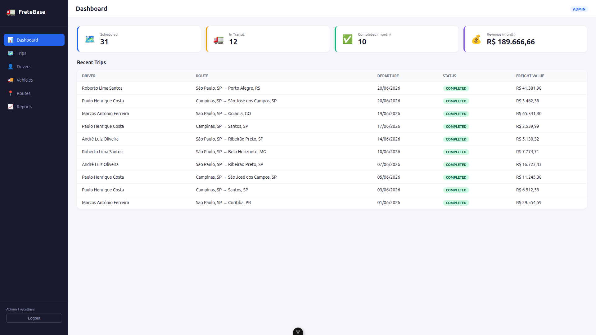
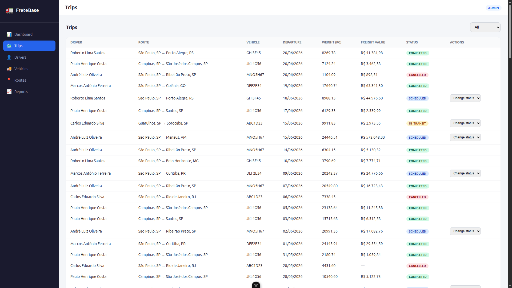
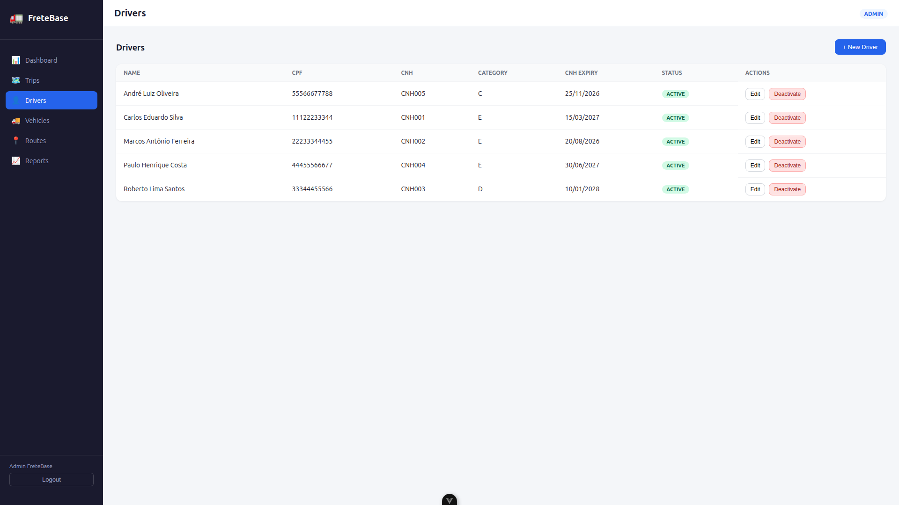
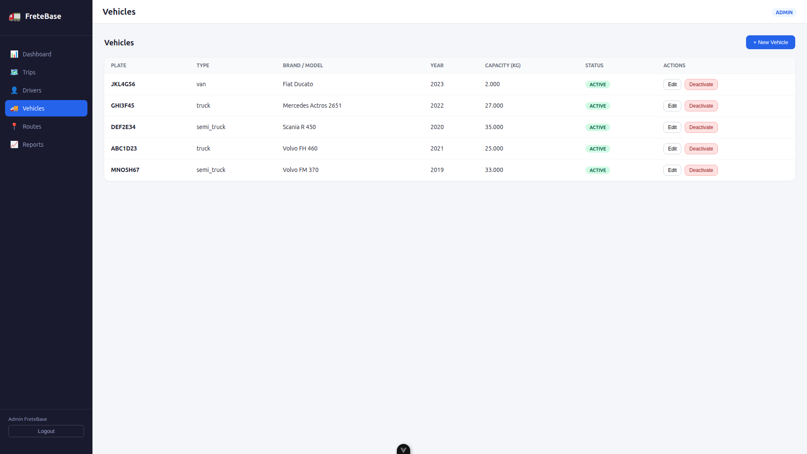
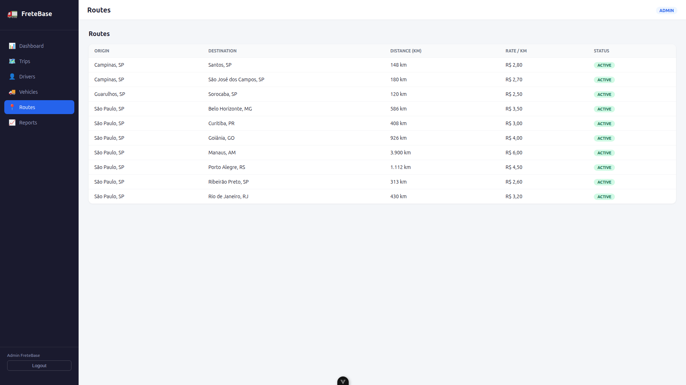
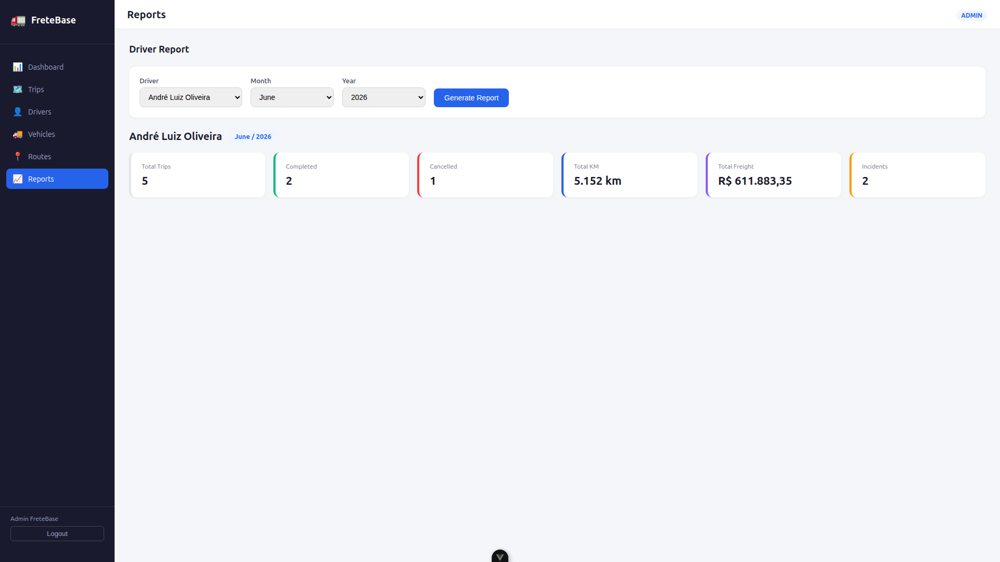

# FreteBase

O FreteBase é um sistema de gestão de transportes (TMS) desenvolvido como projeto de portfólio. A ideia foi simular o núcleo operacional de ERPs reais do setor de transporte rodoviário.

## Telas

### Dashboard



### Viagens



### Motoristas



### Veículos



### Rotas



### Relatório por Motorista



## Como o sistema funciona

O sistema é dividido em três partes:

- **Frontend** feito em Vue.js, que é o que o usuário vê e usa no navegador
- **Backend** feito em Node.js com Express, que recebe as requisições do frontend e conversa com o banco
- **Banco de dados** PostgreSQL, onde ficam os dados e também parte da lógica do sistema

A parte mais importante da arquitetura é que as regras de negócio mais críticas ficam dentro do banco de dados, em blocos de código chamados **stored procedures**. Isso é exatamente como sistemas ERP corporativos como o Visual Rodopar funcionam: o banco não serve só para guardar dados, ele também processa e valida as informações.

Por exemplo, quando uma viagem é criada, o cálculo do valor do frete não é feito no backend em JavaScript. Ele é feito dentro do banco, pela procedure `calculate_freight`. Isso garante que o valor seja sempre calculado da mesma forma, independente de como o sistema for acessado.

## Tecnologias usadas e por que cada uma

| Camada                  | Tecnologia        | Por que foi escolhida                                                           |
| ----------------------- | ----------------- | ------------------------------------------------------------------------------- |
| Frontend                | Vue.js 3          | Framework JavaScript progressivo, simples e produtivo para construir interfaces |
| Gerenciamento de estado | Pinia             | Solução oficial do Vue para compartilhar dados entre componentes                |
| Navegação               | Vue Router        | Roteamento oficial do Vue, permite navegar entre páginas sem recarregar         |
| Backend                 | Node.js + Express | Leve, rápido e usa JavaScript, mesma linguagem do frontend                      |
| Banco de dados          | PostgreSQL 16     | Banco relacional robusto e com suporte a stored procedures                      |
| Autenticação            | JWT + bcryptjs    | Padrão de mercado para autenticação stateless em APIs REST                      |
| Segurança               | Helmet + CORS     | Proteção básica de headers HTTP e controle de origem das requisições            |

## Stored Procedures

Três procedures foram criadas para simular regras de negócio reais de um TMS:

**`calculate_freight(trip_id)`**
Calcula o valor do frete com base na distância da rota, na tarifa por km e no peso da carga. O resultado é salvo diretamente na viagem dentro do banco.

**`complete_trip(trip_id, arrived_at)`**
Valida se a viagem está em trânsito antes de concluir. Se a chegada ocorreu mais de 24 horas depois da saída, uma ocorrência de atraso é registrada automaticamente.

**`driver_report(driver_id, month, year)`**
Retorna um resumo do motorista no período: total de viagens, km rodados, valor de fretes e ocorrências. Essa procedure alimenta a tela de relatórios.

## Estrutura do projeto

fretebase/

├── backend/

│ ├── src/

│ │ ├── config/ # Conexão com o banco

│ │ ├── controllers/ # Lógica de cada rota da API

│ │ ├── middleware/ # Autenticação JWT

│ │ └── routes/ # Definição dos endpoints

│ ├── database/

│ │ ├── migrations/ # Criação das tabelas

│ │ ├── procedures/ # Stored procedures

│ │ └── seeds/ # Dados de exemplo

│ └── server.js

├── frontend/

│ └── src/

│ ├── components/ # Sidebar e Header

│ ├── views/ # Páginas da aplicação

│ ├── services/ # Chamadas à API

│ ├── stores/ # Estado global (auth)

│ └── router/ # Rotas do frontend

└── screenshots/

## Banco de dados

drivers ──┐

vehicles ├──→ trips ──→ incidents

routes ──┘
users (autenticação)

## Como rodar localmente

**Requisitos:** Node.js 18+, PostgreSQL 16, Git

**1. Clone o repositório**

```bash
git clone https://github.com/jpbatista-dev/fretebase.git
cd fretebase
```

**2. Configure o banco**

```bash
sudo -u postgres psql
```

```sql
CREATE USER fretebase WITH PASSWORD 'fretebase123';
CREATE DATABASE fretebase OWNER fretebase;
GRANT ALL PRIVILEGES ON DATABASE fretebase TO fretebase;
\q
```

**3. Rode as migrations e procedures**

```bash
cd backend
psql -U fretebase -d fretebase -h localhost -f database/migrations/001_initial_schema.sql
psql -U fretebase -d fretebase -h localhost -f database/procedures/calculate_freight.sql
psql -U fretebase -d fretebase -h localhost -f database/procedures/complete_trip.sql
psql -U fretebase -d fretebase -h localhost -f database/procedures/driver_report.sql
psql -U fretebase -d fretebase -h localhost -f database/seeds/seed.sql
```

**4. Configure as variáveis de ambiente**

```bash
cp .env.example .env
# edite o .env com suas credenciais
```

**5. Inicie o backend**

```bash
npm install
npm run dev
```

**6. Inicie o frontend**

```bash
cd ../frontend
npm install
npm run dev
```

Acesse: `http://localhost:5173`

**Login de acesso:**

- Email: `admin@fretebase.com`
- Senha: `password123`

## Dados de exemplo

O seed popula o banco com:

- 2 usuários (admin e operador)
- 5 motoristas
- 5 veículos
- 10 rotas entre cidades brasileiras
- 120 viagens dos últimos 6 meses
- 20 ocorrências registradas
